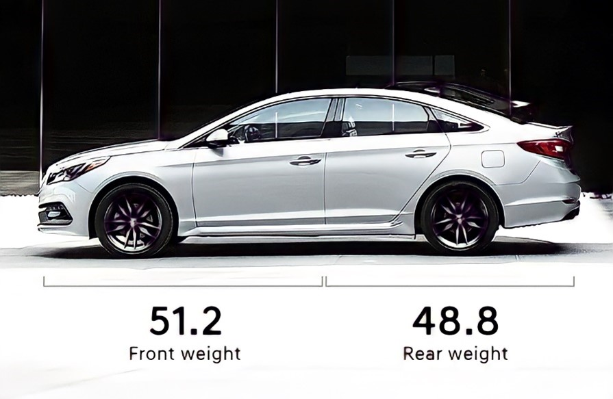
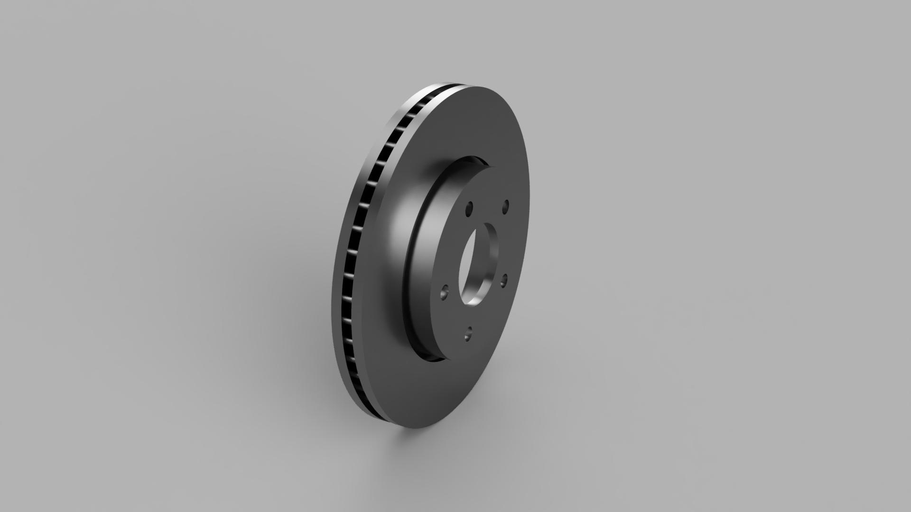

## Introduction

## Problem statement and inital calculations

## CAD modeling and meshing

The models were made in Solidworks, and are based on drawings of OEM replacement brake rotors for the Sonata. 

## CFD simulations

## Thermal simulations

## Results and discussion

## References

  1. Belhocine, A., Cho, C. D., Nouby, M., Yi, Y. B., & Abu Bakar, A. R. (2014). Thermal analysis of both ventilated and full disc brake rotors with frictional heat generation.

  2. Thermal Radiation Properties Survey, Honeywell Research Center.

  3. Stephens, A. (2006). Aerodynamic cooling of automotive disc brakes (Doctoral dissertation, RMIT University).

  4. Kumar, B. B. Thermal Analysis of Disc Brake Rotor.

  5. Cavusoglu, Ö. F. (2017). Aerodynamics around wheels and wheelhouses (Doctoral dissertation, Chalmers University of Technology).

  6. ANSYS manuals
